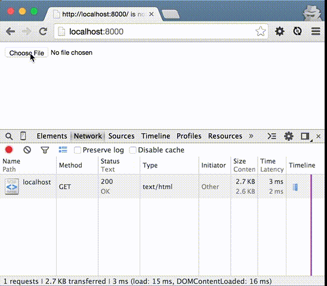

# AWS S3 Browser Upload Example

Vanilla JavaScript (and Node.js) example to upload a file directly, asynchronously (AJAX) to Amazon Web Services (AWS) Simple Storage Service (S3) from the browser using AWS Signature Version 4



## Setup

You'll need [Node.js](http://nodejs.org/) installed and an AWS account. There are no external dependencies code-wise.

### IAM

You'll need an access key id (`AWS_ACCESS_KEY_ID`) and secret access key (`AWS_SECRET_ACCESS_KEY`)

1. Create or choose an existing User
2. On their profile, scroll down to the Security Credentials section and "Manage Access Keys"
3. "Create Access Key" (limit 2 per user)

**Replace [`AWS_ACCESS_KEY_ID` in `upload.html`](https://github.com/maxbeatty/aws-s3-browser-upload-example/blob/master/upload.html#L9) and use your own `AWS_SECRET_ACCESS_KEY` when starting the node server below**

### S3

1. "Create Bucket" in S3
2. [Generate Policy](http://awspolicygen.s3.amazonaws.com/policygen.html) (sample below)

    ```
{
  "Version": "2008-10-17",
  "Id": "Policy123456",
  "Statement": [
  {
    "Sid": "Stmt123456",
    "Effect": "Allow",
    "Principal": {
      "AWS": "*"
      },
      "Action": [
      "s3:PutObject"
      ],
      "Resource": "arn:aws:s3:::your-bucket-name/*"
    }
    ]
  }
    ```

3. "Edit bucket policy" in the Permissions section of your bucket's Properties (save the policy you generated)
4. "Edit CORS Configuration" in the Permissions section of your bucket's Properties (sample below)

    ```
<?xml version="1.0" encoding="UTF-8"?>
<CORSConfiguration xmlns="http://s3.amazonaws.com/doc/2006-03-01/">
  <CORSRule>
    <AllowedOrigin>*</AllowedOrigin>
    <AllowedMethod>POST</AllowedMethod>
    <AllowedHeader>*</AllowedHeader>
  </CORSRule>
</CORSConfiguration>
    ```

5. "Save" your Permissions (just in case the other saves didn't save?)

Your bucket should now be ready to upload files to.

## Usage

1. Start server (`AWS_SECRET_ACCESS_KEY=wJalrXUtnFEMI/K7MDENG/bPxRfiCYEXAMPLEKEY node index.js`)
2. Open [http://localhost:8000](http://localhost:8000)
3. Choose a file to upload (you'll see a progress bar and a link to your file when complete)

## Questions? Problems?

Please create an [issue](https://github.com/maxbeatty/aws-s3-browser-upload-example/issues).
